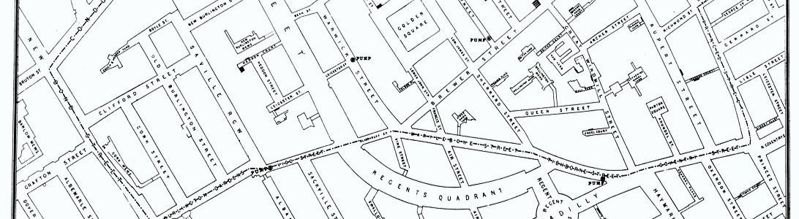
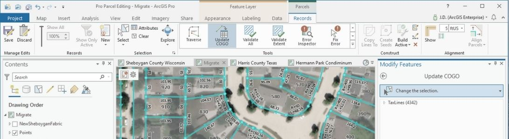
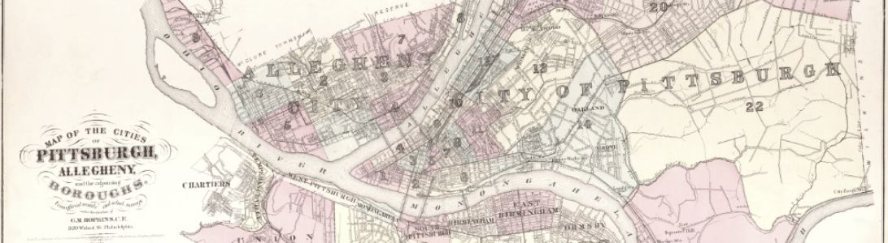

GIS Day (November 17) is an international celebration of this scientific framework often implemented by using software for gathering, analyzing, and visualizing geographic or georeferenced data. GIS enthusiasts from the University of Pittsburgh have organized several exciting events for GIS Day. 

### List of events

* [GIS and the Ghost Map](#ghost), Thurs Nov. 11, 2–3:30 pm ET
* [Virtual Career Panel](#career), Fri Nov. 12, 1–2 pm ET 
* [GIS Research Forum](#research), Wed Nov. 17, 11:30am–12:30pm ET
* [Space and Film: Geography as a Major Actor (exhibit)](#film), starting Mon Nov. 8

More information about each event is below.

----------

## GIS and the Ghost Map

**Thursday, November 11, 2–3:30pm ET**\
Presenter: **Dr. Susan Lucas (Urban Studies)**

> In this hands-on workshop participants will use easy to understand spatial statistics to explore historical data on a cholera epidemic that occurred in Soho, London in 1854.  In his now famous analysis of the distribution of cholera deaths around Soho's Broad Street pump, John Snow used a map of cholera to convince city officials that the water supplied to the Broad Street pump was the cause of the cholera epidemic.  In this workshop participants will use georeferenced data on cholera deaths from 1854 to explore point pattern analysis and basic spatial statistics in ArcMap. 

Register: [https://pitt.libcal.com/event/8088954](https://pitt.libcal.com/event/8088954)

----------

## Virtual Career Panel 

**Friday, November 12, 1–2pm ET**\
Moderator: **Dr. Roberta De Carvlho** (Urban Studies Program, University of Pittsburgh)

Participants:
* **Kevin Colaizzi**, Senior GIS Analyst at Civil and Environmental Consultants, Inc 
* **Dr. Williams Castro**, an Analytics and Modeling Manager at Accenture Co., supporting the United States Department of State, whose work involves finding business solutions through enhancement of data storage and analysis, in-house sharing and dissemination of geospatial data, development of tools and applications for sharing within the bureau and with diplomatic missions overseas. 
* **Sophia Constantine**, a recent graduate from the Urban Studies Program who works as an Associate Transportation Planner at Nelson\Nygaard.             
* **Ellen Kinnee**, a Geographic Information System Analyst at the University Center for Social & Urban Research, University of Pittsburgh, where she provides GIS support for environmental exposure and qualitative survey research. 

Online: [https://pitt.zoom.us/j/95713642122](https://pitt.zoom.us/j/95713642122); Passcode: **761707**

----------

## GIS Research Forum  

**Monday, November 17, 11:30am–12:30pm ET**\
Moderator: **Susan Lucas** (Urban Studies)

Presenters:  

* **Josh Canon**, Honors College 
* **Bill Harbert**, Geology and Environmental Science 
* **Matthew Brahms**, Student, Urban Studies Program 
* **Anna Baskin**, Student, Honors College 

> In Celebration of GIS Day, the University of Pittsburgh will be hosting a GIS Research Forum with faculty and student presenters. GIS, or Geographic Information Systems, is a tool to analyze, organize, and represent data across geographic space. The Research Forum will showcase different research projects using GIS, from archaeological applications to exploring the relationship between climate change and terrorism. Please join us for the presentations and conversations that will follow. 

Online: [https://pitt.zoom.us/j/97957243854](https://pitt.zoom.us/j/97957243854)

\
_Image: Desatured detail of the index map from the 1872 Atlas of the cities of Pittsburgh, Allegheny, and the adjoining boroughs, [Historic Pittsburgh](https://historicpittsburgh.org/maps-hopkins/1872-atlas-pittsburgh-allegheny)_

----------

## Space and Film: Geography as a Major Actor (exhibit) 

Exhibit curator: **Boris Michev**, GIS Librarian at the University of Pittsburgh Library System 

Curator’s statement:
> The exhibit explores the interrelationship between space and film based on several pictures that vividly illustrate the argument about the utmost importance of geography. We intended to show the opportunities that GIS allows us by creating original or using already existing maps, which tell the story of the film and help us grasp the enormousness of the tasks the characters undertake. We have also tried to introduce a little humor in the whole enterprise by predicting where Mr. Bond will travel in his next movie. Since the Bond analysis was done before the latest film, it will be interesting to see if it has been spot-on or not. 

Access online after Monday, November 8: [StoryMap](https://storymaps.arcgis.com/stories/5f1a9c2347424a8e927b31fedf483b4b)

